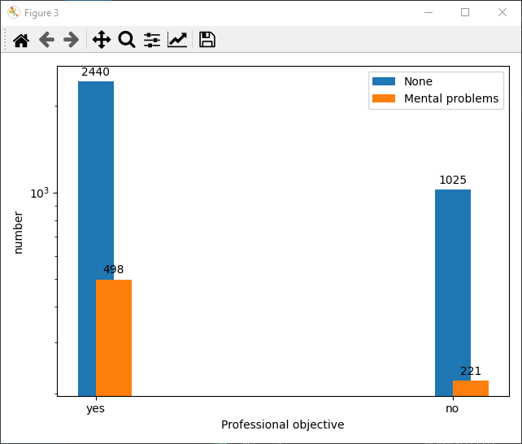
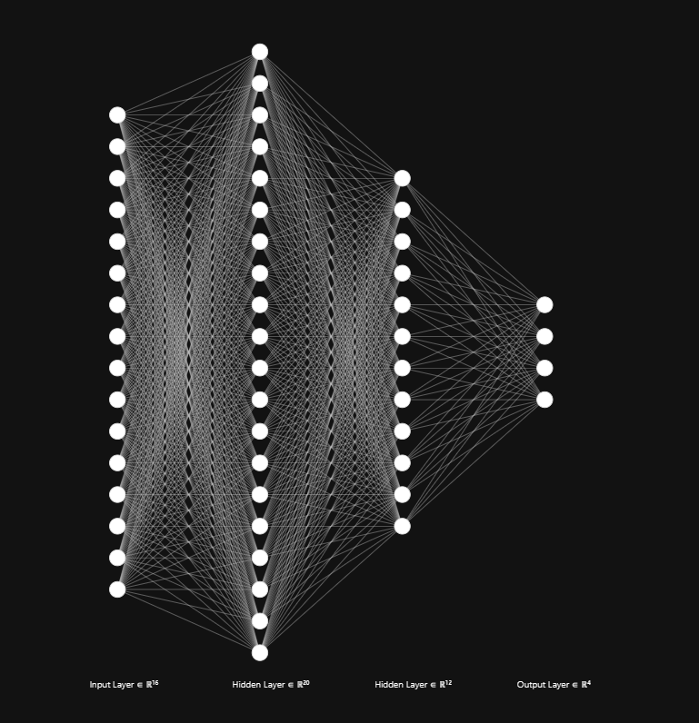
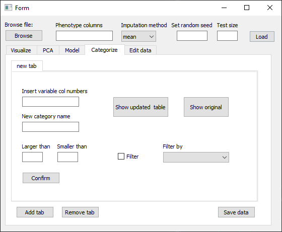
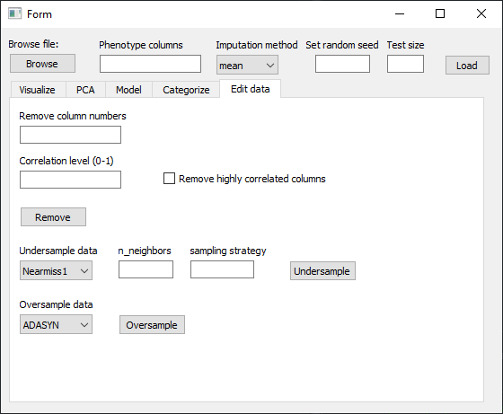
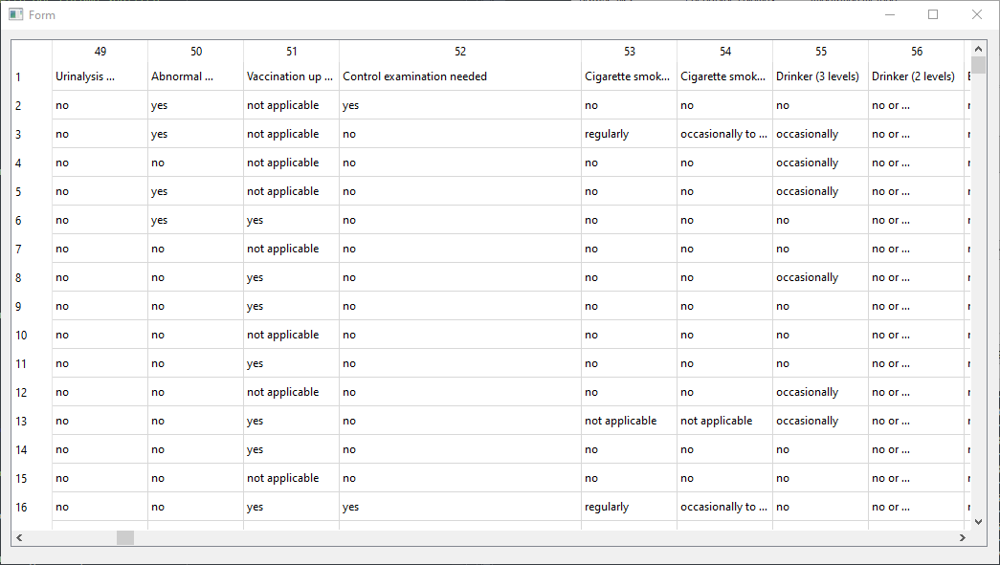

# DL-model

## Packages
All packages should be installed when running the gui_assignmentv3.py file.
However, if they are not installed or issues arrise here is a list of used packages.

- numpy 1.21.5
- pandas 1.4.4
- matplotlib 3.5.2
- keras 2.11.0
- tensorflow 2.11.0
- sklearn 1.0.2
- scipy 1.9.1
- PyQt5 22.3
- openpyxl 3.0.10
- xlrd 2.0.1
- imblearn 0.10.1

## How to use

Run the gui_assignmentv3.py file to start.

The browse button can be used to set the directory of the .csv/.xlsx file that needs to be analysed.
When the file is loaded it is necessary to give the columns that represent the phenotypes of interest.
An imputation method for the data can also be chosen at this point with the default set as 'mean'.
See sklearn.impute for more information about this.
After the column names are given the data can be loaded and is ready for use.

The first visualize tab can be used to visualize the data. By selecting a variable of interest the
barplot of this variable will be generated with groups of bars representing the levels of this variable and 
the colors representing the phenotypes of interest as can be seen in the legend.

The second tab contains an option to plot the PCA analysis of the numerical varibles in the loaded data
by clicking on the 'PCA' button.

In the third window it is possible to set up the deep learning models that will be used for analysis.
The layers and number of nodes in layers can be specified such that '20,12,4' would represent the network as
depicted below, where an arbitrary input number is chosen (16). Furthermore a dropout value between each laywer can be specified.

(generated with https://alexlenail.me/NN-SVG/index.html)

This all goes for a single model but using the add tab function we can add more models with different layers
and dropout values. The final result will be an embedded model of all the model tabs in this window.
If one model needs to be removed this can be done by clicking the remove tab button.

For the population of models we can set some settings such as the bootstrap size, the seed that should be used
and the number of epochs (the settings apply to all model tabs).

When everything is set the models can be run by clicking the model button. Results of which will be displayed in
the console and by plots.

The fourth window adds an option to categorize the numerical data. While the model can handle combinations of
numerical and categorial data, sometimes it might be desired to change a column into categorial data.
In this window the column **numbers** that need to be changed can be filled in. The bounds of the numerical data 
can be filled in in the larger than and smaller than sections. Above which name of the category can be given.
If it is necessary to add a subfilter based on the value of another variable in another column,
the filter checkbox can be checked and a subfilter can be selected in the drop down window.
Multiple tabs can be added to change multiple columns without having to change the values everytime.

Options to view te modified data are also available when clicking show updated table.
The original loaded data can also be shown by clicking show original.
The new data can also be saved by clicking the save data button. This new data will be stored in the same folder
as the original data with the suffix '_edited'.

In the final window we can edit the data either manually by giving the column **numbers** that we like to remove,
or by removing based on high correlation between the columns. This can be done by checking the checkbox and giving
a threshold correlation value. Any column that correlates above this value with another column will be removed upon
clicking the remove button.
Under and oversampling methods can also be chosen in this window. When clicking the respective buttons the data 
will be augmented according to the algorithm selected.
See 'imblearn' documentation for more information about the methods.

## Example

For this example the file wellbeing_merged.csv will be used, which is an edited version of the wellbeing.xls file[1].
(pre edited using this widget)

The file is loaded in with the browse button.

After which the phenotype columns will be selected by providing the column names seperated by commas.

Moving to the categorize tab to view the table we decide to remove the column'control examination needed'

We will move to the edit data tab to this column in this case column number 50.
We also want to remove columns that have a correlation of larger than 0.85.

After this we are ready to set up the model parameters.
We will move to the model tab and make a model consisting of 5 layers with the first layer having 120 nodes,
the second layer having 40, the third layer having 80, the fourth 20 and the final layer having 2 layers. The final layer must have as many nodes as 
there are phenotype variables (no mental health issues and mental health issues).
We will also choose a dropout rate of 0.3. If you want to add another model this is possible with the add tab option.
However, for this example we will just stick with one. For this model we will set a bootstrap size of 32,
random seed of 42 and 300 epochs. If we run this without filling in these settings it will run the default ones,
which is 32 bootstrap size, random seed of 42 and 100 epochs.

The results will be shown in a plot and in the command window

{'loss': 0.5225058197975159, 'accuracy': 0.7726315855979919, 'Precision': 0.7023809552192688, 'Recall': 0.7452631592750549}

The most important features in the data will be extracted and plotted in a bar plot showing
(higher loss change -> more importance)

## Notes

- It may still be a bit buggy and sometimes requires a restart 
- The edited file in the repository is an already categorized file, categories are chosen based on data from [2]
[3][4]

## References

[1] Tran, A., Tran, L., Geghre, N., Darmon, D., Rampal, M., Brandone, D., Gozzo, J.-M., Haas, H., Rebouillat-Savy, K., Caci, H., & Avillach, P. (2018). Data from: Health assessment of French university students and risk factors associated with mental health disorders (Version 1) [Data set]. Dryad. https://doi.org/10.5061/DRYAD.54QT7

[2] Data downloads &gt; NCD (no date) RisC. Available at: https://ncdrisc.org/data-downloads.html (Accessed: December 22, 2022). 

[3] Target heart rates chart (2022) www.heart.org. Available at: https://www.heart.org/en/healthy-living/fitness/fitness-basics/target-heart-rates (Accessed: December 22, 2022). 

[4] Padilla, O. and Abadie, J. (2022) Urine tests: Normal values - resources, MSD Manual Professional Edition. MSD Manuals. Available at: https://www.msdmanuals.com/professional/resources/normal-laboratory-values/urine-tests-normal-values (Accessed: December 22, 2022). 