# DL-model

## Packages
To install all required packages run pip install -requirements.txt
It's recommended to create a virtual environment before doing this

## How to use

Run the main.py file to start.

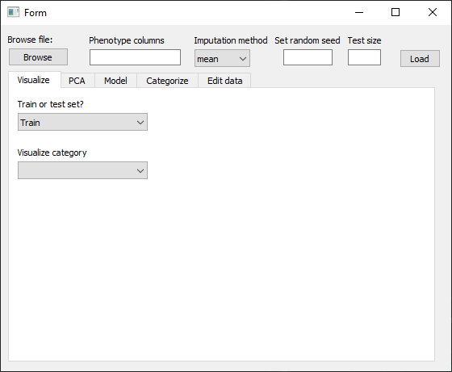

The browse button can be used to set the directory of the .csv/.xlsx file that needs to be analysed.
When the file is loaded it is necessary to give the columns that represent the phenotypes of interest.
If no column names are provided it will stick with the default of 'Mental health issues'
An imputation method for the data can also be chosen at this point
with the default set as 'mean' for numerical data and constant for categorical data.
See sklearn.impute for more information about this.
Additionally a random seed can be set for the entirety of the analysis as well as a test split size given decimal number (e.g. 0.1)
The data will be split in a training and test set from this point onwards.

The first visualize tab can be used to visualize the data. From here a selection can be made on whether to visualize the train or test set.
By selecting a variable of interest the barplot of this variable will be generated with groups of bars representing the levels of this variable and 
the colors representing the phenotypes of interest as can be seen in the legend.

Upon loading the data, a window will pop up that shows the difference between the cumulative distributions of the test and train set
and boxplots showing the difference between numerical variables. This is to determine if the test set it a good representation of the training set and vice versa.
Since splitting occurs randomly a new random seed can be chosen to make sure that there is a good representation of the data in both datasets.

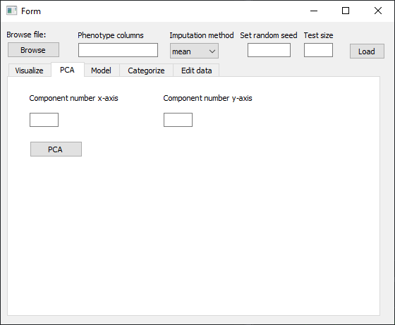

The second tab contains an option to plot the PCA analysis of the numerical varibles in the loaded data
by clicking on the 'PCA' button. The PCs of interest to be displayed can also be provided as input with the default being 1 and 2.
Clicking the PCA button will result in the PCA plot of the 2 selected PCs, loading plots and a plot that shows explained variance per PC.

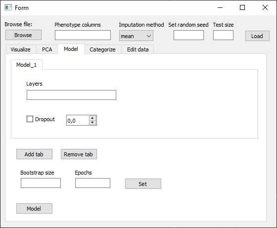

In the third window it is possible to set up the deep learning models that will be used for analysis.
The layers and number of nodes in layers can be specified such that '20,12,4' would represent the network as
depicted below, where an arbitrary input number is chosen (16). Furthermore a dropout value between each laywer can be specified.
It is important that the final layer is the same size as the number of phenotypes/classes.

(generated with https://alexlenail.me/NN-SVG/index.html)

This all goes for a single model but using the add tab function we can add more models with different layers
and dropout values. The final result will be an embedded model of all the model tabs in this window.
If one model needs to be removed this can be done by clicking the remove tab button.

For the population of models we can set some settings such as the bootstrap size, the seed that should be used
and the number of epochs (the settings apply to all model tabs).

When everything is set the models can be run by clicking the model button. Results of which will be displayed in
the console and by plots.

The fourth window adds an option to categorize the numerical data. While the model can handle combinations of
numerical and categorial data, sometimes it might be desired to change a column into categorial data.
In this window the column **numbers** that need to be changed can be filled in. The bounds of the numerical data 
can be filled in in the larger than and smaller than sections. Above which name of the category can be given.
If it is necessary to add a subfilter based on the value of another variable in another column,
the filter checkbox can be checked and a subfilter can be selected in the drop down window.
Multiple tabs can be added to change multiple columns without having to change the values everytime.

Options to view te modified data are also available when clicking show updated table.
The original loaded data can also be shown by clicking show original.
The new data can also be saved by clicking the save data button. This new data will be stored in the same folder
as the original data with the suffix '_edited'.

In the final window we can edit the data either manually by giving the column **numbers** that we like to remove,
or by removing based on high correlation between the columns. This can be done by checking the checkbox and giving
a threshold correlation value. Any column that correlates above this value with another column will be removed upon
clicking the remove button.
Under and oversampling methods can also be chosen in this window. When clicking the respective buttons the data 
will be augmented according to the algorithm selected.
See 'imblearn' documentation for more information about the methods.

When under/over sampling methods are applied similar windows as when the data loads will pop up. These are again to check if the 
down/upsampled data represents the entire dataset well enough.

## Example

For this example the file wellbeing_merged.csv will be used, which is an edited version of the wellbeing.xls file[1].
(pre edited using this widget)

The file is loaded in with the browse button with a random seed of 23 and the test samples = 0.1 x samples data.
Selected phenotype column is "mental health issues"

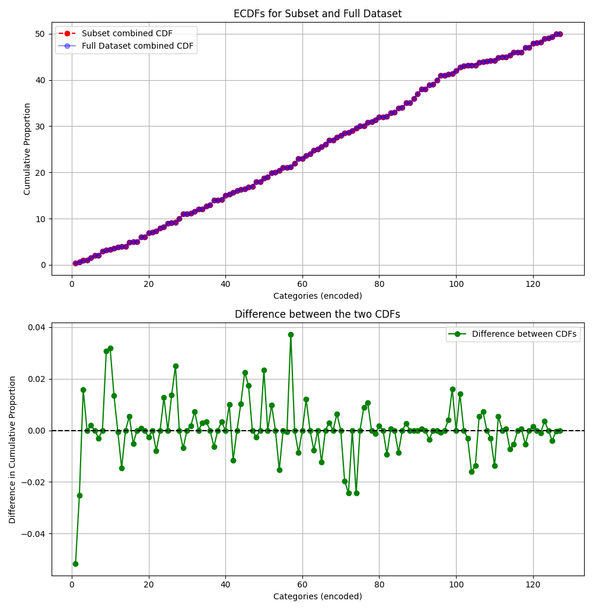

When loaded in the windows showing the numerical and cumulative categorical variables show up.

For the boxplots 2 examples are shown. The p-values indicate the values returned by the Kolmogorov-Smirnov test.
When the p value is greater than 0.05 the null-hypothesis which states that the distributions are different is rejected.
In this case the null-hypothesis is not rejected thus the distribution between the test and training set are similar.

For the cumulative categorical distribution the difference is plotted and a line is printed in the console.
The console line states that the difference between the 2 distributions is significant if the Kolmogorov-Smirnov test Null-hypothesis can be rejected.
So here we can also conclude that there is not a significant difference between the sets. 

Moving to the categorize tab to view the table we decide to remove the column'control examination needed'

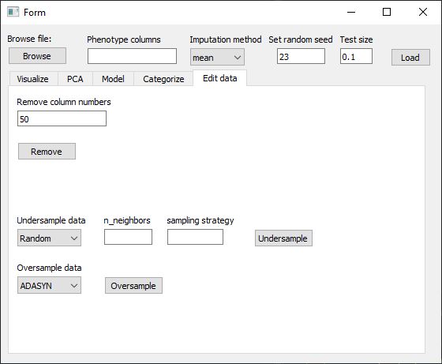

We will move to the edit data tab to this column in this case column number 50.
After which we run the undersample method with random as parameter, giving us random undersampling to balance the classes.

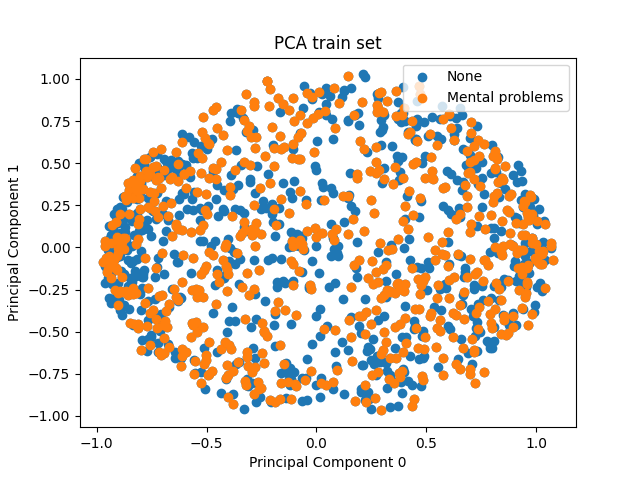
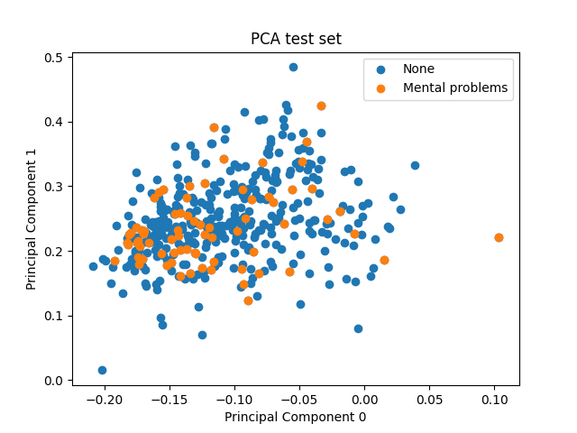
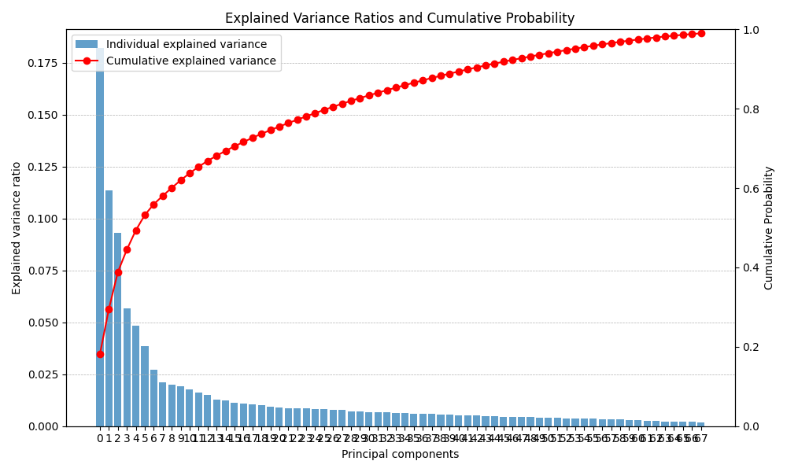
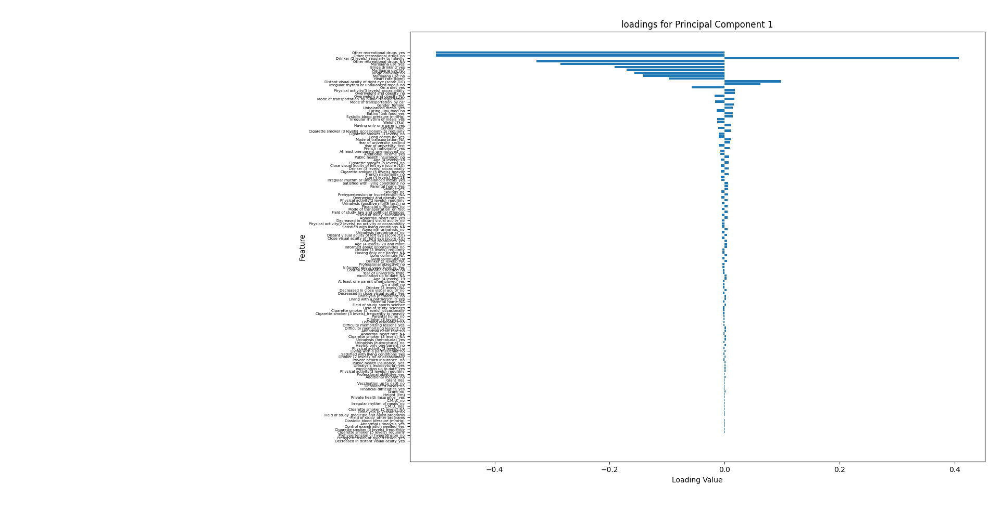
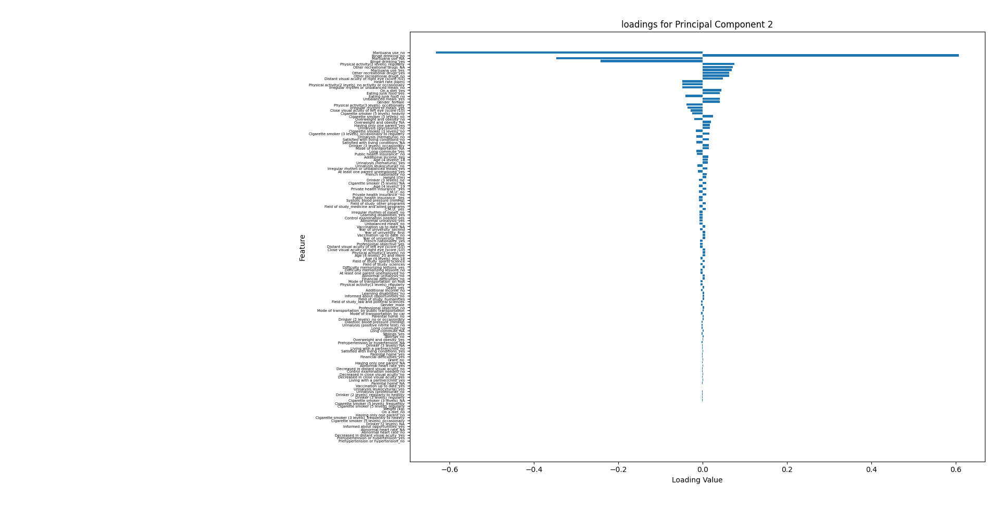

Running the PCA gives us the PCA of the train in test set, with the loading plot and explained variance for each PC.
The results of the PCA are not great as there is no clear distinction between classes in the plot.
This makes sense since the number of components needed to explain 95% of the variance is almost all of the PCs.
The PCA does show a clear overrepresentation of the healthy class.
This we can resolve by downsampling this majority class.
We use random downsampling here.

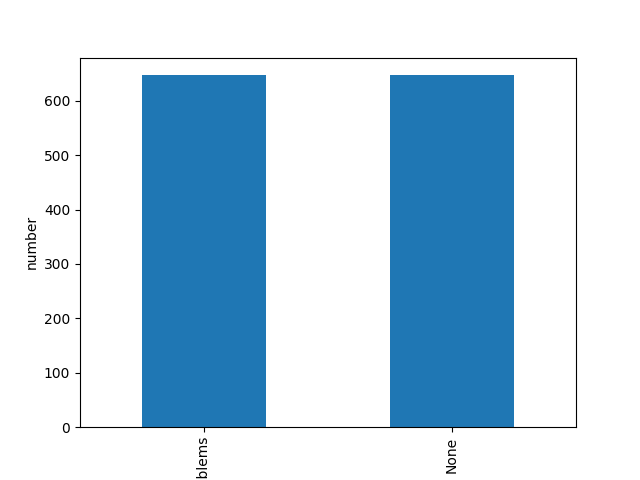
We can go back to the first tab to see that the total numbers have indeed changed and the classes are now balanced

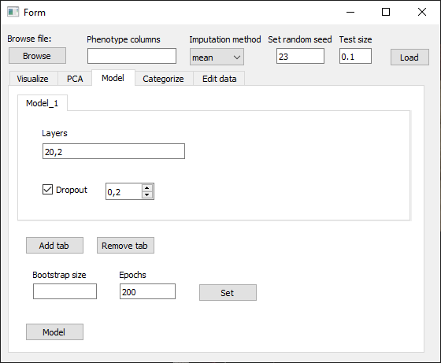

Moving on to the neural network model, we are ready to set up the model parameters.
We will move to the model tab and make a model consisting of 2 layers with the first layer having 40 nodes, the middle layer 20 nodes and the final layer having 2 nodes. 
The final layer must have as many nodes as there are phenotype variables (no mental health issues and mental health issues).
We will also choose a dropout rate of 0.2. If you want to add another model this is possible with the add tab option.
However, for this example we will just stick with one. For this model we will set a bootstrap size of 32,
random seed of 1 and 1000 epochs. If we run this without filling in these settings it will run the default ones,
which is 32 bootstrap size, random seed of 42 and 100 epochs.

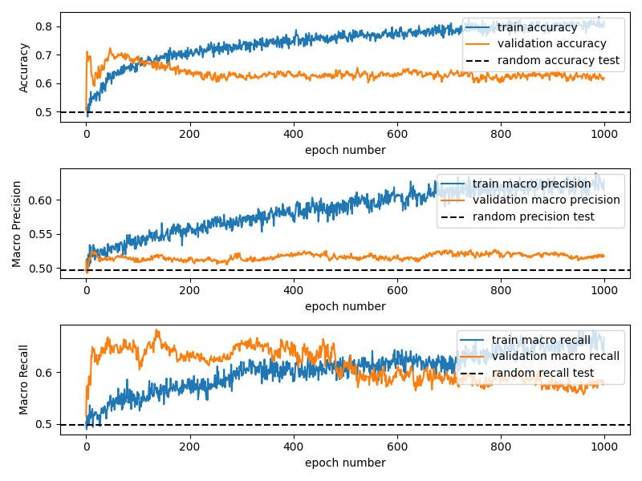

The results will be shown in a plot and in the command window. Categorical accuracy, macro precision and macro recall are displayed.
The dotted line is the result if the classifier would randomly classify the classes.

{'loss': 0.5859974026679993, 'categorical_accuracy': 0.6181384325027466, 'macro_precision': 0.5173971056938171, 'macro_recall': 0.5805574655532837}
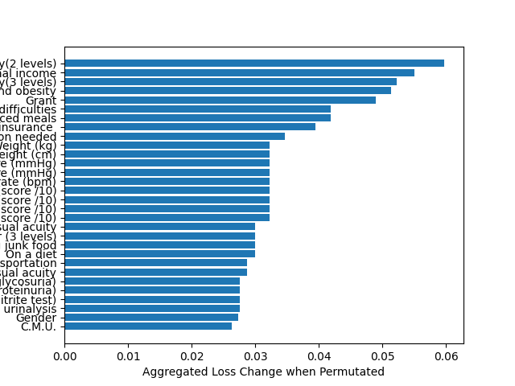

The most important features in the data will be extracted and plotted in a bar plot showing
(higher loss change -> more importance)

## Notes

- It may still be a bit buggy and sometimes requires a restart 
- The edited file in the repository is an already categorized file, categories are chosen based on data from [2]
[3][4]

## References

[1] Tran, A., Tran, L., Geghre, N., Darmon, D., Rampal, M., Brandone, D., Gozzo, J.-M., Haas, H., Rebouillat-Savy, K., Caci, H., & Avillach, P. (2018). Data from: Health assessment of French university students and risk factors associated with mental health disorders (Version 1) [Data set]. Dryad. https://doi.org/10.5061/DRYAD.54QT7

[2] Data downloads &gt; NCD (no date) RisC. Available at: https://ncdrisc.org/data-downloads.html (Accessed: December 22, 2022). 

[3] Target heart rates chart (2022) www.heart.org. Available at: https://www.heart.org/en/healthy-living/fitness/fitness-basics/target-heart-rates (Accessed: December 22, 2022). 

[4] Padilla, O. and Abadie, J. (2022) Urine tests: Normal values - resources, MSD Manual Professional Edition. MSD Manuals. Available at: https://www.msdmanuals.com/professional/resources/normal-laboratory-values/urine-tests-normal-values (Accessed: December 22, 2022). 